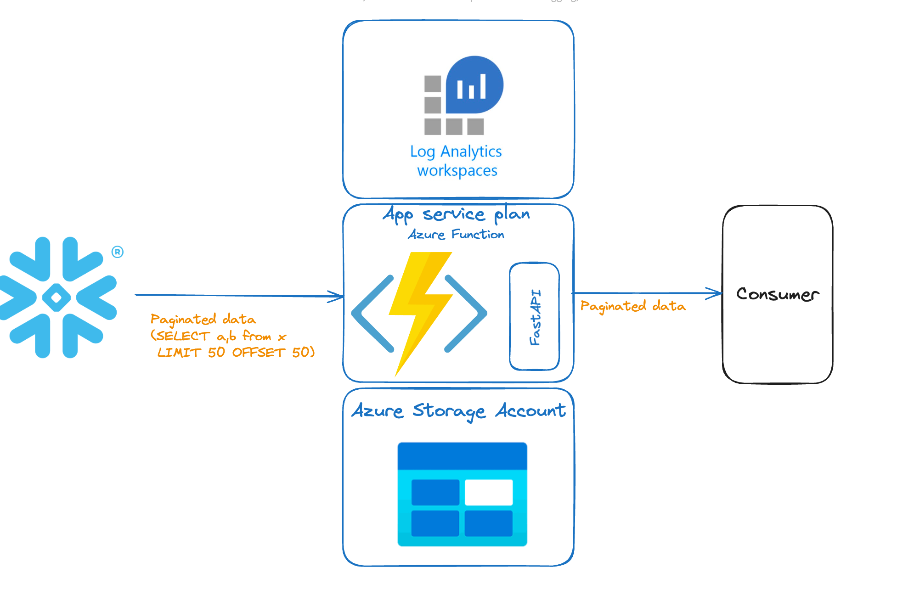
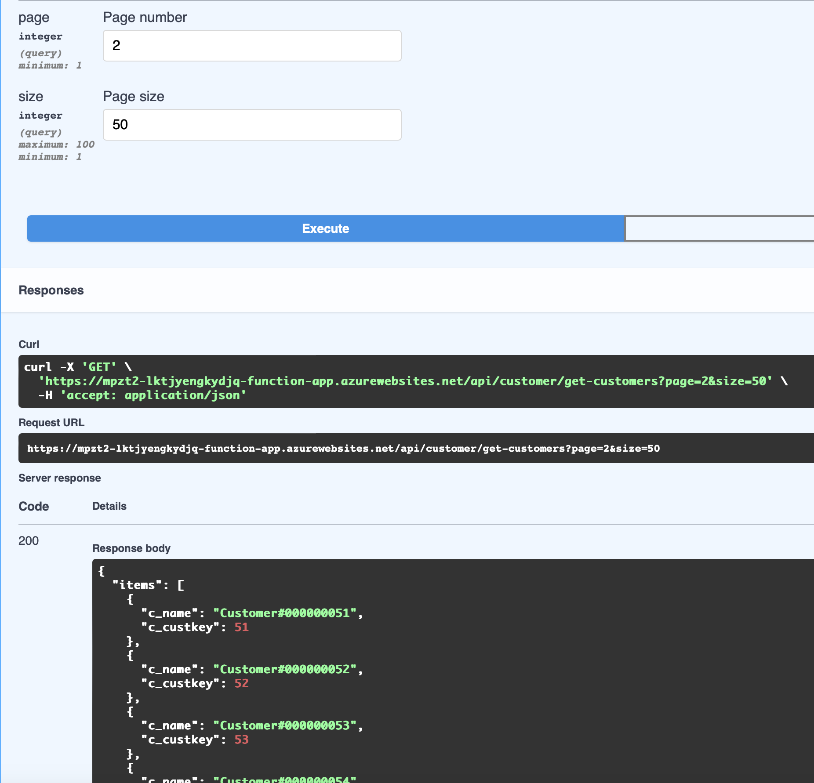
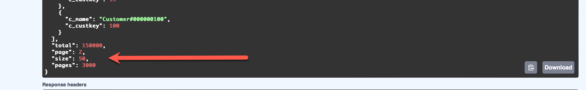

# Using FastAPI Framework with Azure Functions

Azure Functions supports WSGI and ASGI-compatible frameworks with HTTP-triggered Python functions. This can be helpful if you are familiar with a particular framework, or if you have existing code you would like to reuse to create the Function app. The following is an example of creating an Azure Function app using FastAPI.

This example exposes a Snowflake table as an API endpoint, using pagination. Pagination is key because by breaking up large datasets into smaller, manageable chunks, APIs can deliver data more efficiently and improve overall performance.



## True Pagination

For true pagination to ocurr the following needs to happen:

- The request to the database must be paginated
- The response to the consumer must be paginated

### Paginating the request to the database

We do not want snowflake or any other database to send millions of rows to our function, that will cause the function to fail. (memory overflow)

This example make sure that request to the database are paginated, a typical SQL look like:

```
SELECT customer.c_custkey, customer.c_name 
FROM customer ORDER BY customer.c_custkey
 LIMIT 50 OFFSET 50
```

This example exposes the table: SNOWFLAKE_SAMPLE_DATA.TPCH_SF1.CUSTOMERS that is shipped with Snowflake.

We can see here that only 50 records (one page, in this case the second page (offset 50)) are being requested from the database.

After you deploy this example,you can go to:

(https://yourfunctionsurl)/docs

And you will see the following:



And in the response you can also see that the total numbrer of pages is returned:




## Prerequisites

You can develop and deploy a function app using either Visual Studio Code or the Azure CLI. Make sure you have the required prerequisites for your preferred environment:

* [Prerequisites for VS Code](https://docs.microsoft.com/azure/azure-functions/create-first-function-vs-code-python#configure-your-environment)
* [Prerequisites for Azure CLI](https://docs.microsoft.com/azure/azure-functions/create-first-function-cli-python#configure-your-local-environment)
* Snowflake account (you can geet a free trial)

## Setup

Clone or download [this sample's repository](https://github.com/miguelp/simple-fastapi-snow-azd/), and open the `simple-fastapi-snow-azd` folder in Visual Studio Code or your preferred editor (if you're using the Azure CLI).


## Running the sample

### Testing locally

0. Create a .env file, this file should contain the following: 
(THIS STEP IS MANDATORY, create this file before deploying to Azure)

```
SNOWFLAKE_URL = xxxxxx.region.hyperscaler
SNOWFLAKE_USERNAME = youruser
SNOWFLAKE_PASSWORD = yourpassworr
SNOWFLAKE_DATABASE = SNOWFLAKE_SAMPLE_DATA/TPCH_SF1
```

NOTE: Before moving this to production implement a Keyvault reference for your password/certificate. It is recommended to use AZURE API management to expose functions as APIs.

1. Create a [Python virtual environment](https://docs.python.org/3/tutorial/venv.html#creating-virtual-environments) and activate it.

2. Run the command below to install the necessary requirements.

    ```log
    python3 -m pip install -r requirements.txt
    ```

3. If you are using VS Code for development, click the "Run and Debug" button or follow [the instructions for running a function locally](https://docs.microsoft.com/azure/azure-functions/create-first-function-vs-code-python#run-the-function-locally). Outside of VS Code, follow [these instructions for using Core Tools commands directly to run the function locally](https://docs.microsoft.com/azure/azure-functions/functions-run-local?tabs=v4%2Cwindows%2Cpython%2Cportal%2Cbash#start).

4. Once the function is running, test the function at the local URL displayed in the Terminal panel:
=======
```log
Functions:
        http_app_func: [GET,POST,DELETE,HEAD,PATCH,PUT,OPTIONS] http://localhost:7071//{*route}
```

    ```log
    Functions:
            WrapperFunction: [GET,POST] http://localhost:7071/{*route}
    ```

    Try out URLs corresponding to the handlers in the app, both the simple path and the parameterized path:

    ```
    http://localhost:7071/docs
    ```

### Deploying to Azure

There are three main ways to deploy this to Azure:

* [Deploy with the VS Code Azure Functions extension](https://docs.microsoft.com/en-us/azure/azure-functions/create-first-function-vs-code-python#publish-the-project-to-azure). 
* [Deploy with the Azure CLI](https://docs.microsoft.com/en-us/azure/azure-functions/create-first-function-cli-python?tabs=azure-cli%2Cbash%2Cbrowser#create-supporting-azure-resources-for-your-function).
* Deploy with the Azure Developer CLI: After [installing the `azd` tool](https://learn.microsoft.com/en-us/azure/developer/azure-developer-cli/install-azd?tabs=localinstall%2Cwindows%2Cbrew), run `azd up` in the root of the project. You can also run `azd pipeline config` to set up a CI/CD pipeline for deployment.

All approaches will provision a Function App, Storage account (to store the code), and a Log Analytics workspace.

![Azure resources created by the deployment: Function App, Storage Account, Log Analytics workspace]
### Testing in Azure

Once deployed, test different paths on the deployed URL, using either a browser or a tool like Postman.

```
http://<FunctionAppName>.azurewebsites.net/docs
```

## Next Steps

Now you have a simple Azure Function App using the FastAPI framework, that serves paginated data from Snowflake.

To learn more about leveraging WSGI and ASGI-compatible frameworks, see [Web frameworks](https://docs.microsoft.com/azure/azure-functions/functions-reference-python?tabs=asgi%2Cazurecli-linux%2Capplication-level#web-frameworks).